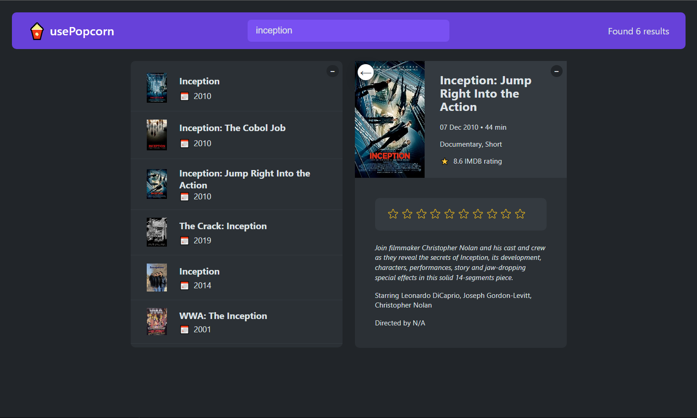

# React usePopCorn project 🍿🎬

**This project is a movie site which using React features.**

## What you can do with this project?
- You can **search** for a movie with a specific name.
- You can get more information about the movie by clicking on the movie you are looking for. Film length, production date, film genre, film content, producer name, actors and imdb rating.
- You can **rate** the movie you watched and add it to your watched list.
- You can change your rating and remove any movie you want from your watched list.

## Which React features did I use?
- React controlled elements to take control of search input.
- Conditional rendering depending on search status. "Start searching", "Loading", "Not Found" etc.
- Fetching data from API based on search key.
- Custom hooks to fetch data, save local storage and keyPress situations.
- useState and useEffect to keep UI sync with data.
- Complately reusable and flexible StarRating component which can be used other projects. Used Proptypes, external state.
- Clearing previous API calls after each data entered in the input field to improve performance.
- UseRef to select an element in the component in order not to break the declarative structure of React.

